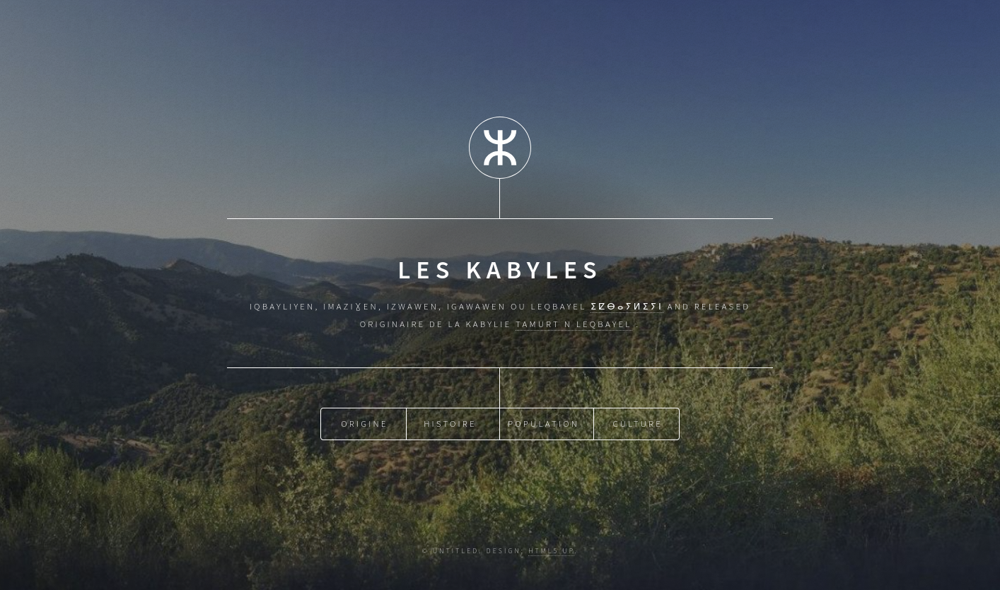

# Site Web les Kabyle

Bienvenue sur se petit projet ! Ce site a été créé pour représenter et promouvoir la culture kabyle, ses traditions, son histoir, sa langue et son patrimoine.

## Table des matières

- [À propos](#à-propos)
- [Fonctionnalités](#fonctionnalités)
- [Technologies utilisées](#technologies-utilisées)
- [Installation](#installation)
- [Contribuer](#contribuer)
- [Licence](#licence)

## À propos

Le site vise à fournir des informations sur la culture kabyle, y compris des articles, des images, des vidéos et des ressources. Il est conçu pour être accessible et informatif pour tous ceux qui s'intéressent à la culture kabyle.
tout les information vien de la page wikipedia [https://fr.wikipedia.org/wiki/Kabyles](https://fr.wikipedia.org/wiki/Kabyles)

## Fonctionnalités

- Présentation de la culture kabyle
- Articles sur l'histoire et les traditions
- Galerie d'images

## Technologies utilisées
une template html5 du site https://html5up.net/ 
- HTML5
- CSS3
- JavaScript
- [html5up.net](https://html5up.net/)

